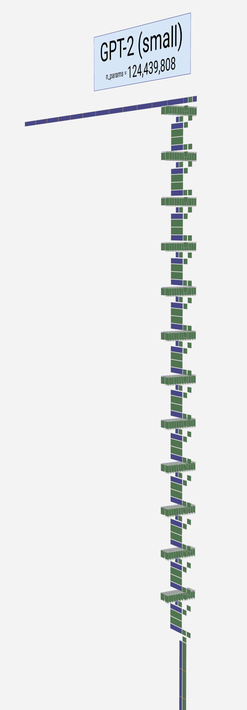
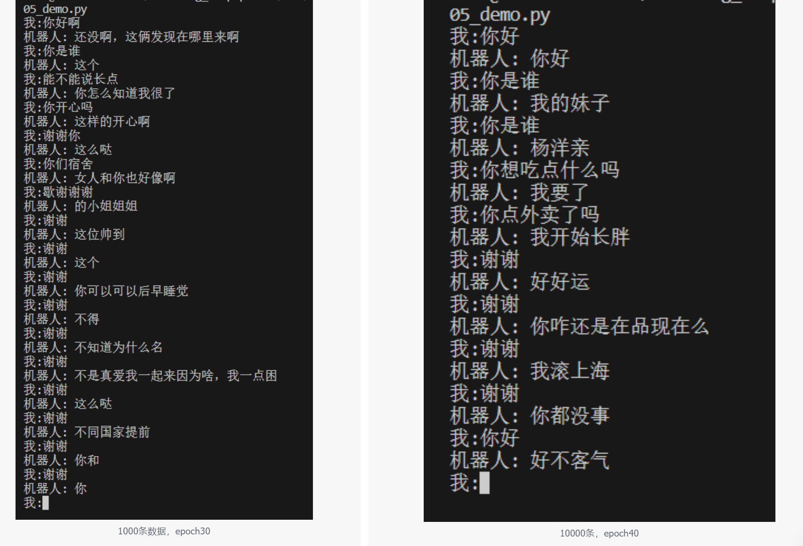

# Small_GPT_ChineseChat

GPT模型介绍并且使用pytorch实现一个小型GPT中文闲聊系统  
教程：https://blog.csdn.net/weixin_44599230/article/details/124103879  

已将链接中的代码整理到本项目中:  
01 数据预处理 将对话整理成条  /small_gpt_chinesechat/data/dataset.txt    
02 词表构建  /small_gpt_chinesechat/data/dict_datas.json  
03 模型构建  
04 训练模型  
05 demo测试    
图片展示参见飞书记录：   

模型采用的是GPT-2结构模型，参考图如下（layer=12, head=12, 参数量：1.2亿）：  
<!---->

模型结构：  
layers: 6  
head: 8  
参数量：0.4亿  
embedding_size: 768  
CLIP : 1  

数据：
50万条中文闲聊对话数据  /small_gpt_chinesechat/data/dataset.txt  
跑demo的时候尝试了1000条和10000条，权重都有保存    

demo测试结果：  
<!--    -->

